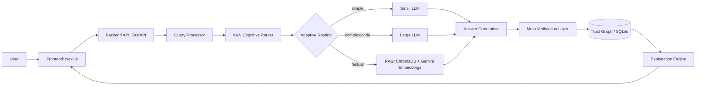

# TellMeWhy - Architecture (Milestone 1)

## Vision
An AI Reasoning Workspace, not a chatbot. Every screen answers one of: *Why trust this? What evidence? What assumptions? How confident? What changed confidence? Should I verify?*

## Data Flow



## Core Modules

| Module | Responsibility | Never Does |
|---|---|---|
| KAN Cognitive Router | Predicts complexity, ambiguity, domain, retrieval need, expected confidence, token budget, carbon estimate, routing decision - as structured metadata | Generate answers |
| Adaptive Routing Engine | Dispatches to small LLM / large LLM / RAG based on KAN output + Trust Slider | Score or verify |
| Meta Verification Layer | Splits answer into atomic claims, verifies each, attributes sources, detects contradictions, refines confidence | Generate answers |
| Trust Graph | Central store all subsystems write structured metadata into (SQLite-backed) | Invent data |
| Explanation Engine | Reads Trust Graph only, renders human-readable explanations | Invent explanations |

## Why KAN is isolated

`backend/app/kan/` exposes a single stable interface:

```python
class CognitiveRouter(Protocol):
    def analyze(self, query: QueryInput) -> RoutingDecision: ...
```

`RoutingDecision` is a fixed pydantic schema (complexity_score, ambiguity_score, domain, needs_retrieval, needs_clarification, expected_confidence, token_budget, carbon_estimate_g, route). Any implementation (heuristic, small model, actual KAN network) can be swapped behind this interface without touching the router, API, or frontend - enforced by the pydantic contract, not convention.

## Backend Folder Structure

```
backend/
  app/
    main.py                  # FastAPI app entrypoint
    core/
      config.py               # Settings (env-driven)
      logging.py
    kan/
      __init__.py
      interface.py            # CognitiveRouter Protocol + I/O schemas
      heuristic_router.py      # Default swappable implementation
    routing/
      __init__.py
      adaptive_engine.py       # Chooses small LLM / large LLM / RAG
      llm_clients.py
    verification/
      __init__.py
      claim_splitter.py
      verifier.py
    trust_graph/
      __init__.py
      graph_store.py           # Reads/writes SQLite trust graph
      schema.py                # Pydantic models mirroring DB schema
    models/
      __init__.py
      schemas.py                # Shared request/response pydantic models
    db/
      __init__.py
      database.py               # SQLite engine/session
      schema.sql
      chroma_client.py
    api/
      __init__.py
      routes/
        query.py
        trust.py
        sources.py
  requirements.txt
  .env.example
  pyproject.toml
```

## Frontend Folder Structure

```
frontend/
  src/
    main.tsx                 # Vite entrypoint
    App.tsx                  # Workspace shell
    index.css
    vite-env.d.ts
    components/
      QueryComposer.tsx      # F1
      TrustSliderControl.tsx # F9
      RoutingSummary.tsx     # F10 (basic - full graph viz in Milestone 5)
      AnswerPanel.tsx
    lib/
      api.ts                 # Typed fetch client against the FastAPI backend
    types/
      api.ts                 # Mirrors backend/app/models/schemas.py
    store/
      useWorkspaceStore.ts    # zustand: query lifecycle state machine
    hooks/                   # (empty - populated as needed from Milestone 5 on)
  index.html
  vite.config.ts
  package.json
  tsconfig.json
  tailwind.config.ts
  .env.example
```

Plain React (Vite) - not Next.js. No SSR/routing framework needed for a single-workspace hackathon app.

## Database Schema (SQLite - Trust Graph)

See [backend/app/db/schema.sql](../backend/app/db/schema.sql).

Tables: `queries`, `routing_decisions`, `reasoning_steps`, `sources`, `claims`, `trust_scores`, `confidence_events`, `knowledge_graph_nodes`, `knowledge_graph_edges`.

Vector storage (embeddings for RAG) lives in ChromaDB, separate from SQLite - SQLite holds structured metadata/relations only.

## Next Steps (Milestone 2)
FastAPI app skeleton, DB engine wiring, first API endpoints (`POST /query`, `GET /trust/{query_id}`), request/response schemas.

Note - 
Find the user persona for this project. We can't make it for everyone. Tailor it according to the following viewpoint.
Show animations/images/ or some other thing that is interactive. 
Understand the demographic and how it should be displyed. Think from user perspective.